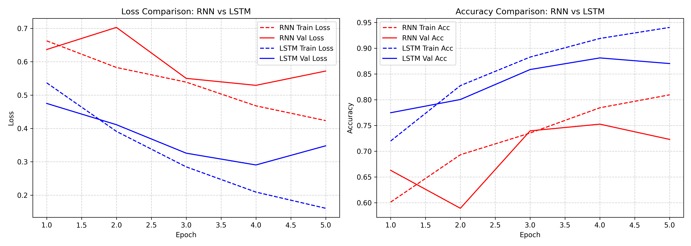

# Sentiment Analysis: RNN vs. LSTM Benchmark

A comparative study evaluating the performance, convergence rate, and generalization of **Vanilla Recurrent Neural Networks (RNN)** versus **Long Short-Term Memory (LSTM)** networks for binary sentiment classification on the IMDB Large Movie Review Dataset.

---

## Overview

Recurrent neural networks process sequential data by maintaining an internal hidden state across time steps. However, standard Vanilla RNNs suffer from vanishing and exploding gradients when handling long textual sequences due to repeated matrix multiplications in the backpropagation-through-time (BPTT) pathway.

LSTMs address this fundamental limitation by introducing a memory cell state and three distinct gating mechanisms:
- **Forget Gate**: Regulates which information from the previous cell state should be discarded.
- **Input Gate**: Determines which new candidate values should be stored in the cell state.
- **Output Gate**: Controls which parts of the updated cell state should be emitted as the hidden state.

This repository benchmarks both architectures under identical experimental setups (dataset, vocabulary, embedding size, hidden dimension, layer depth, learning rate, and optimizer).

---

## Architecture and Preprocessing

- **Dataset**: Large Movie Review Dataset (`aclImdb`) consisting of 25,000 training and 25,000 test reviews labeled as positive (1) or negative (0).
- **Text Normalization**: Stripping HTML tags (`<br />`), non-alphanumeric character removal, lowercasing, and whitespace trimming.
- **Vocabulary**: Frequency-filtered vocabulary with `<pad>` (index 0) and `<unk>` (index 1) special tokens.
- **Sequence Handling**: Dynamic batch padding and sequence packing using PyTorch's `pack_padded_sequence` to ignore padded tokens during recurrence.
- **Model Pipeline**:
  - Word Embedding: `nn.Embedding(vocab_size=20,002, embedding_dim=128, padding_idx=0)`
  - Recurrent Backbone: 2-Layer Bidirectional RNN or 2-Layer Bidirectional LSTM (`hidden_dim=128`, `dropout=0.3`)
  - Bidirectional Concatenation: Merging the final forward and backward hidden states (dimension 256)
  - Regularization: Dropout (`p=0.3`)
  - Classification Head: Linear projection layer (`256 -> 2`) with `nn.CrossEntropyLoss`

---

## Experimental Results

Both models were trained on CUDA for 5 epochs using the Adam optimizer (`lr=1e-3`) with gradient clipping (`clip=5.0`) and batch size 32.

### Final Performance Summary

| Metric | Vanilla RNN | Bidirectional LSTM | Delta |
| :--- | :---: | :---: | :---: |
| **Trainable Parameters** | 2,725,634 | 3,220,226 | +494,592 (+18.1%) |
| **Final Train Loss** | 0.4234 | **0.1605** | -0.2629 |
| **Final Train Accuracy** | 80.95% | **94.03%** | +13.08% |
| **Final Validation Loss** | 0.5721 | **0.3479** | -0.2242 |
| **Final Validation Accuracy** | 72.29% | **87.02%** | **+14.73%** |
| **Best Validation Accuracy** | 75.25% | **88.11%** | **+12.86%** |

### Training Curves

Below is the comparative training and validation progression across epochs:



### Key Findings

1. **Long-Term Dependency Preservation**: Movie reviews frequently span hundreds of words. Vanilla RNN hidden states decay over long contexts, limiting peak validation accuracy to **75.25%**. In contrast, the LSTM cell state preserves long-range sentiment signals, achieving **88.11%** peak validation accuracy.
2. **Convergence and Fitting Capacity**: The LSTM demonstrates significantly higher expressive capacity, driving training loss down to **0.1605** (94.03% accuracy) compared to **0.4234** (80.95% accuracy) for the Vanilla RNN.
3. **Parameter Efficiency**: While the recurrent weights in an LSTM are roughly four times larger than an RNN of the same hidden size (due to 4 internal gates), the embedding matrix dominates the total parameter count in both networks. Consequently, the LSTM requires only an 18.1% increase in total trainable parameters while delivering a **~14.7% absolute gain** in final validation accuracy.

---

## Project Structure

```text
├── data.py                   # Preprocessing, vocabulary builder, dataset loading, and collate function
├── model.py                  # SentimentClassifier module supporting RNN and LSTM cell types
├── trainer.py                # Trainer class managing training, validation, tqdm logging, and checkpointing
├── main.py                   # Main CLI script for dataset loading, training, benchmarking, and plotting
├── rnn_vs_lstm_comparison.png# Generated loss and accuracy comparison plot
├── aclImdb/                  # IMDB dataset directory (excluded via .gitignore)
├── README.md                 # Project documentation and benchmark report
└── .gitignore                # Git ignore rules
```

---

## Getting Started

### 1. Requirements

- Python 3.8+
- PyTorch >= 2.0
- tqdm
- matplotlib
- numpy

Install dependencies:
```bash
pip install torch tqdm matplotlib numpy
```

### 2. Dataset Setup

> [!NOTE]
> Due to file size limits and repository best practices, the `aclImdb` dataset is not tracked in this repository (it contains 50,000 text files and is ignored via `.gitignore`).

Download the [Stanford Large Movie Review Dataset (aclImdb v1)](https://ai.stanford.edu/~amaas/data/sentiment/aclImdb_v1.tar.gz) and extract it into the project root directory:

```bash
# Download and extract
curl -O https://ai.stanford.edu/~amaas/data/sentiment/aclImdb_v1.tar.gz
tar -xzf aclImdb_v1.tar.gz
```

Verify that the `aclImdb` directory is structured as follows:
```text
aclImdb/
├── train/
│   ├── pos/
│   └── neg/
└── test/
    ├── pos/
    └── neg/
```

### 3. Run Benchmark

Run the full benchmark (trains both RNN and LSTM, prints comparison table, and generates the comparison plot):
```bash
python main.py
```

### 4. Optional Arguments

```bash
python main.py \
  --data_dir ./aclImdb \
  --epochs 5 \
  --batch_size 32 \
  --hidden_dim 128 \
  --num_layers 2 \
  --dropout 0.3 \
  --lr 0.001 \
  --seed 42 \
  --plot
```
